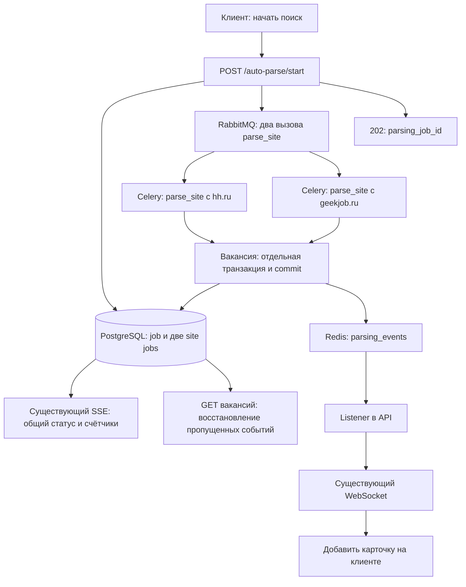

# Параллельный автопарсинг через Celery и выдача вакансий через WebSocket

Статус: готово к реализации. Этот документ описывает будущие изменения; код ещё не реализован.

Исполнитель: GPT-5.5, reasoning low. Выполнять по одной задаче T01–T10, в указанном порядке. Архитектурные решения и контракты ниже уже выбраны; не заменять их альтернативами без необходимости.

## 1. Результат для пользователя

После запуска поиска API быстро возвращает `parsing_job_id`, не ожидая сайтов. Две независимые задачи одной функции `parse_site` обрабатывают HH и GeekJob одновременно при наличии двух свободных слотов Celery. Каждая сохранённая вакансия сразу появляется в интерфейсе через существующее WS-соединение. Общий прогресс продолжает приходить по существующему SSE.

Готовность первой вакансии не зависит от завершения остальных вакансий, своего сайта или второго сайта. Перезагрузка страницы не останавливает парсинг; клиент восстанавливает сохранённые результаты из БД через API.

## 2. Текущее состояние и точки изменения

Все пути ниже — относительно корня репозитория.

| Место | Текущее поведение |
| --- | --- |
| `backend/app/api/v1/endpoints/auto_parse_router.py` | `/start` создаёт `ParsingJob`, затем ожидает `run_parse_job`. Здесь же WS и SSE прогресса. |
| `backend/app/services/scraper/vacancy_scraper.py` | Последовательно обходит HH и GeekJob. Детали вакансий получает через `gather` с `Semaphore(4)`. Одна `AsyncSession` передаётся нескольким корутинам; commit выполняется после всего списка сайта. |
| `backend/app/tasks/single_generation.py` | Образец Celery-задачи с `@async_task` и `publish_event_sync`. |
| `backend/app/tasks/listener/single_generation_listener.py` | Redis-событие пересылается пользователю через `WebSocketManager`. |
| `backend/app/tasks/listener/__init__.py` | Автоматически импортирует модули listener-пакета. |
| `backend/app/main.py` | Импортирует listener-пакет и запускает подписчиков в lifespan. При остановке сейчас пропущен `await stop_all_listeners()`. |
| `backend/app/decorators/async_tasks.py` | Каждый вызов задачи использует `asyncio.run`; в конце освобождается `celery_engine`. |
| `backend/app/database.py` | Для Celery уже есть `celery_async_session_maker` с `NullPool`. |
| `backend/app/celery_app.py` | Очередь `default`, JSON, result backend явно не настроен. |
| `backend/docker-compose.local.yml` | Один сервис Celery с `--concurrency=4`, RabbitMQ и Redis уже есть. |
| `frontend/src/pages/AutoParsePage.tsx` | WS обрабатывает только генерацию письма; JSON читается без защиты, объекты вакансий мутируются. |
| `frontend/src/features/auto-parse/hooks/useAutoParse.ts` | SSE обновляет прогресс, вакансии обычно загружаются только при `done`. |
| `frontend/src/hooks/useWebSocket.ts` | Адрес зашит на localhost, переподключения нет; обработчик захватывается при первом рендере. |

Обнаруженные локальные особенности, которые нужно учитывать при реализации:

- В рабочем дереве удалён `backend/app/job_parser/hh_parser.py`, но `general.py` и `vacancy_scraper.py` импортируют из него `Vacancy`. Минимальная модель содержит `name: str`, `link: str`, `vacancy_id: str`. Перенести этот DTO в `schemas/vacancy`, не восстанавливая удалённый старый парсер.
- `chromium_module.chromium.context` в текущем fetch-методе не соответствует модулю браузера: `context` хранится отдельной переменной модуля. Новый код получает настоящий `BrowserContext` явно.
- `get_name()` возвращает домен: ключи реестра должны быть `hh.ru` и `geekjob.ru`, а не аргумент `geek_job` из конструктора.
- В рабочем дереве есть другие пользовательские изменения. Проверять `git diff` и сохранять их; не делать массовый рефакторинг.

## 3. Зафиксированная архитектура



1. Одна Celery-задача `app.tasks.parse_site`, параметры `job_id: int, site_key: str`. `query` и `user_id` задача читает из `ParsingJob`; клиент не выбирает произвольные классы или адреса парсеров.
2. API публикует отдельный вызов `.apply_async()` для каждого ключа серверного реестра. Последовательная публикация двух сообщений не означает последовательное выполнение задач. В API нет ожидания `get/join` результатов Celery.
3. Очередь остаётся `default`. При четырёх свободных prefork-процессах два сайта займут два процесса. Закрепление сайта за конкретным процессом не требуется; занятая очередь может задержать запуск.
4. Внутри `parse_site` сохраняется асинхронная обработка деталей с `Semaphore(4)` на сайт. Для двух сайтов это до восьми одновременно обрабатываемых деталей плюс страницы поиска. Не создавать Celery task на каждую вакансию.
5. Один браузер на выполнение `parse_site`, созданный и закрытый внутри её event loop. Использовать `pw_browser` из `decorators/browser.py` либо его минимальное расширение; явный локальный контекст для деталей. API-глобалы Playwright в worker не использовать.
6. Завершение определяется в PostgreSQL по состояниям двух site jobs. Не вводить `chord`, result backend или отдельную задачу-финализатор. В текущем проекте это позволяет опереться на существующую БД; `chord` требует настроенного result backend и отдельной обработки ошибок. [Celery Canvas](https://docs.celeryq.dev/en/stable/userguide/canvas.html#chords).
7. WebSocket передаёт новые вакансии; SSE остаётся источником статуса и счётчиков. Генерация писем и её канал сохраняют существующий контракт.

## 4. Данные, состояния и транзакции

### 4.1. Новая таблица `parsing_site_jobs`

Новая модель `ParsingSiteJob` в `backend/app/models/parsing_site_job.py`:

| Поле | Тип / правило |
| --- | --- |
| `id` | int, PK |
| `parsing_job_id` | FK → `parsing_jobs.id`, NOT NULL, индекс |
| `site_key` | str, NOT NULL; уникальность `(parsing_job_id, site_key)` |
| `status` | `pending / running / done / failed`, default `pending` |
| `total_found` | int, default 0; уникальные найденные ID внутри сайта |
| `saved_count` | int, default 0; действительно вставленные вакансии |
| `failed_count` | int, default 0; детали, не обработанные после существующих повторов парсера |
| `error` | nullable text; краткая диагностическая причина |
| `started_at`, `finished_at` | nullable datetime; согласовать с существующими UTC timestamp |

В `AutoParsedJob` добавить nullable `parsing_site_job_id` с FK на новую таблицу и уникальность `(parsing_site_job_id, vacancy_id)`. Старые записи остаются с NULL, миграция не удаляет и не объединяет исторические данные. Новые записи этого процесса всегда имеют `parsing_site_job_id`, непустой внешний `vacancy_id`, правильные `parsing_job_id` и `user_id`; `web_site = site_key`.

Внешний `vacancy_id: str` — ID сайта. `AutoParsedJob.id: int` — ID нашей БД, ключ карточки и ключ дедупликации WS на клиенте. Не смешивать их.

Миграция: после актуального Alembic head добавить таблицу, поле, FK и unique constraint; зарегистрировать модель в `models/__init__.py`. Новые поля не требуют backfill старых заданий. Downgrade удаляет только добавленную схему; потерю новых метаданных при downgrade указать в инструкции.

### 4.2. Правила состояния

- API одной транзакцией создаёт родительскую job и обе site jobs до публикации сообщений.
- Worker атомарно переводит свою site job из `pending` в `running`. Повторный вызов для `running/done/failed` ничего не запускает и не меняет счётчики.
- Родитель получает `running`, когда стартует хотя бы один сайт. `done` или `failed` ставятся только после терминального состояния всех ожидаемых site jobs.
- Сайт с пустой успешной выдачей завершается `done`, со счётчиками 0.
- Ошибка получения списка или хотя бы одной детали означает `failed` у сайта; остальные детали и второй сайт продолжают работу. Все сохранённые результаты доступны пользователю.
- Если все сайты `done`, родитель `done`. Если хотя бы один `failed`, после окончания всех сайтов родитель `failed`, с краткой сводкой в `error`. Новый статус `done_with_errors` не вводить.
- Ошибки страниц списка нельзя молча отбрасывать как успешную выдачу. Для первой версии при исчерпанной ошибке определения пагинации/страницы завершать получение списка ошибкой сайта; пустая корректная выдача остаётся успехом.
- Генерация писем по-прежнему разрешена только для родительского `done`. Частичные результаты failed-job видны, но изменение этого ограничения не входит в задачу.
- `finished_at` устанавливается один раз при терминальном переходе. Один закончившийся сайт не завершает ещё работающий второй.

### 4.3. Конкурентное сохранение

В `backend/app/repository/parsing_job_repository.py` собрать операции создания site jobs, захвата задачи, регистрации списка, сохранения вакансии, регистрации ошибки детали и завершения сайта.

Каждая параллельная корутина использует собственную короткоживущую `celery_async_session_maker()`; общая `AsyncSession` в `gather` запрещена. Это соответствует требованиям [SQLAlchemy asyncio](https://docs.sqlalchemy.org/en/20/orm/extensions/asyncio.html#using-asyncsession-with-concurrent-tasks).

Для всех изменений общего состояния фиксировать один порядок:

1. Открыть транзакцию; взять `SELECT ... FOR UPDATE` родительской job.
2. Прочитать актуальную site job и проверить допустимость перехода.
3. Изменить site job и родительские счётчики/статус в одной транзакции.
4. Commit и закрытие сессии.

Не удерживать блокировку, соединение или транзакцию во время загрузки страниц/публикации событий. Lock сериализует только короткие записи, сетевой парсинг остаётся параллельным. Читать состояние после получения lock, не использовать устаревшие ORM-объекты из прежней сессии.

До обработки деталей удалить дубли списка по внешнему `vacancy_id`. `total_found` записывается для сайта один раз и прибавляется к родителю в той же транзакции. При сохранении проверять уникальную пару site job + внешний ID; повтор не увеличивает `saved_count` и не перезаписывает письмо/флаги существующей вакансии.

Порядок для одной детали:

```text
получить страницу → разобрать → закрыть страницу
→ вставить AutoParsedJob + увеличить оба saved_count в транзакции
→ commit → собрать JSON DTO → publish_event_sync("parsing_events", payload)
```

При rollback события нет. При ошибке публикации сохранённая вакансия остаётся успешным результатом; логировать сбой, не увеличивать failed_count. После commit не нужно ждать остальных элементов `gather`. Родительские счётчики должны совпадать с суммой site jobs, а `saved_count` — с числом сохранённых новых вакансий.

### 4.4. Публикация задач и границы восстановления

`POST /start` возвращает HTTP 202 и прежнее тело `{"parsing_job_id": 123}` после публикации двух сообщений. Синхронную отправку Celery из async endpoint выполнять через threadpool; использовать ограниченные timeout/retry публикации, не держать HTTP-запрос бесконечно при недоступном брокере.

При ошибке публикации прекратить дальнейшую отправку. Под lock родителя перевести все ещё `pending` site jobs в `failed` с причиной dispatch failure; уже `running` задачи продолжают и закончат родителя по общему правилу. Даже если сообщение фактически дошло, worker увидит `failed` и пропустит его. Ответ HTTP 503: `detail = {"message": "Не удалось запустить все парсеры", "parsing_job_id": 123}`. Клиент сохраняет этот ID, показывает ошибку и отслеживает возможные частичные результаты. Уже опубликованные задачи не отзывать.

Первая версия не добавляет автоматический retry целой site task и не меняет глобальную ack-политику Celery. Существующие ограниченные повторы загрузки страниц остаются. Перехваченные исключения фиксируются в БД; неожиданное исключение задачи после фиксации ошибки пробрасывается для логов Celery.

Ограничение первой версии: SIGKILL/OOM worker, недоступность БД при фиксации ошибки или падение API между commit и публикацией могут оставить нетерминальное задание. Автоматическое восстановление зависших jobs, leases, watchdog и transactional outbox — отдельный этап. Не заявлять exactly-once или гарантированный перезапуск после аварии. Обычное отключение браузера клиента не влияет на Celery.

## 5. Контракт событий и API

### 5.1. Redis → WebSocket

Канал Redis: `parsing_events`. Тип события: `parsing.vacancy_saved`.

```json
{
  "type": "parsing.vacancy_saved",
  "user_id": 7,
  "parsing_job_id": 123,
  "site_key": "hh.ru",
  "vacancy": {
    "id": 456,
    "parsing_job_id": 123,
    "vacancy_id": "987654",
    "url": "https://hh.ru/vacancy/987654",
    "web_site": "hh.ru",
    "job_title": "Python Developer",
    "job_text": "Текст вакансии",
    "is_applied": false,
    "is_viewed": false,
    "is_generated": false,
    "cover_letter_text": "",
    "created_at": "2026-09-18T10:00:00"
  }
}
```

Это пример; данные брать из сохранённой записи. Даты сериализуются в JSON. `user_id` нужен для маршрутизации Redis → WS; listener удаляет его из копии сообщения перед отправкой. На клиент приходит остальная структура, без внутреннего `parsing_site_job_id`.

Создать общий Pydantic `AutoParsedJobRead` и `ParsingVacancySavedEvent` в `backend/app/schemas/api/auto_parse.py`. `AutoParsedJobRead` содержит ровно перечисленные публичные поля вакансии; GET списка и WS используют один сериализатор. Для старых записей `vacancy_id`, `web_site`, `parsing_job_id` допускают NULL согласно хранимым данным; новые WS-события требуют непустой внешний ID и числовой job ID.

Новый listener: `backend/app/tasks/listener/parsing_listener.py`, по образцу генерации. Валидировать тип/поля и совпадение job ID с вложенной вакансией, маршрутизировать только по сохранённому владельцу. Некорректное событие логировать и пропускать; отсутствие WS-соединения — нормальная ситуация. Worker не импортирует `WebSocketManager` и не пытается отправить WS напрямую.

Redis Pub/Sub не хранит события для отключившегося клиента. WS обеспечивает оперативное обновление при исправном соединении; восстановление выполняется через GET. [Redis Pub/Sub delivery semantics](https://redis.io/docs/latest/develop/pubsub/#delivery-semantics).

### 5.2. Существующие HTTP/SSE контракты

- `GET /status/{id}` и SSE `/stream/{id}` сохраняют поля и статусы; добавить `error: string | null` в тип клиента и SSE-сериализацию.
- `GET /jobs/{id}/vacancies` работает для любого состояния job, включая `pending/running/failed`, с прежней проверкой владельца и сортировкой по `id`.
- Не вводить новый endpoint для каждой полученной вакансии и не отправлять HTTP-запрос на каждое WS-событие.
- События генерации сохраняют `batch_id`, `vacancy_id`, `status`, `cover_letter_text`. У них пока нет `type`: клиент распознаёт их отдельной проверкой структуры, не считает любое WS-сообщение генерацией.

## 6. Клиент и восстановление

Обработку WS перенести из страницы в `useAutoParse`, где доступен активный `jobId`. Страница не должна открывать второе соединение.

1. Парсить входящий JSON с `try/catch` и проверкой структуры из `unknown`. Неизвестный тип, некорректный JSON и текстовый echo игнорировать.
2. Для `parsing.vacancy_saved` проверять `parsing_job_id === activeJobId`. Добавить вакансию по `vacancy.id`; повторный parsing event уже известной записи игнорировать, чтобы не затереть более позднее письмо или флаги.
3. Для старого события генерации проверить `Number(batch_id) === activeJobId`, `status === "generated"` и валидные поля. Обновлять объект иммутабельно по внутреннему `vacancy_id` из события генерации.
4. Показывать список по мере появления элементов, даже пока job `running`; счётчики брать из SSE, не увеличивать вслепую при получении WS.
5. После ответа `/start` сразу установить локальную job со статусом `pending`, сохранить ID и подписаться на SSE. Это закрывает окно повторного запуска до первого SSE. Повторить для 503 с job ID, одновременно показав ошибку.
6. Получать snapshot вакансий после установки нового ID, при восстановлении из localStorage, выборе истории, каждом открытии/переподключении WS и при любом терминальном SSE (`done` и `failed`).
7. Пока job `pending/running`, дополнительно сверять snapshot раз в 5 секунд, не более одного запроса одновременно. Это восстанавливает события, потерянные на пути Redis → API при всё ещё открытом WS. Останавливать таймер при терминальном состоянии/смене job/unmount.
8. Все HTTP/SSE/WS callbacks сверяют актуальный ID; ответ старого запроса после смены задания ничего не меняет. Отменять запросы либо использовать generation token. Не допускать stale closure.
9. Snapshot объединять по ID, а не заменять массив так, чтобы исчезли пришедшие за время запроса карточки. Результат — отсортированное по `id` объединение. Для записей, получивших WS/локальное обновление после начала запроса, сохранять свежие локальные поля; остальные обновлять данными snapshot. Использовать локальную ревизию изменений по ID или буфер событий на время запроса, покрыть гонку тестом.
10. `useWebSocket`: URL строится из `API_BASE_URL` через `URL` с заменой `http → ws`, `https → wss`; относительный API URL разрешается относительно `window.location.origin`. Сохраняются существующие путь и query-token auth.
11. Hook хранит актуальные callbacks в ref, сообщает `onOpen` для resync и переподключается с задержками 1, 2, 4, 8, максимум 15 секунд. На unmount очищает сокет/таймеры; при отсутствии токена не запускает reconnect; auth rejection не вызывает бесконечных попыток. React StrictMode не должен создавать оставшиеся активными соединения.

В backend исправить ключ удаления соединения (`user:{id}`) и не позволять disconnect старого сокета удалить уже заменивший его новый: передавать ожидаемый socket при отключении/проверять identity. Поддержка нескольких одновременно активных вкладок на пользователя не добавляется; сохранить нынешнюю модель одного соединения.

## 7. План небольших задач для GPT-5.5 / low

Общие правила исполнения: перед задачей прочитать только перечисленные файлы и зависимые контракты этой спеки; сохранить пользовательские изменения; реализовать один законченный шаг; выполнить его проверки; отметить checkbox только после проверки. Если мешает старый дефект вне скоупа, указать его отдельно. Не запускать реальные сайты в unit-тестах.

### T01 — DTO и реестр парсеров

- [x] Выполнено и проверено.
- Зависимости: нет.
- Файлы: `backend/app/schemas/vacancy/vacancy.py` (новый), `services/scraper/parsers/registry.py` (новый), `services/scraper/parsers/general.py`, `services/scraper/vacancy_scraper.py`, новые `backend/tests/test_parser_registry.py`.
- Создать DTO `Vacancy` с тремя существующими полями; заменить ссылки на удалённый `hh_parser.py` в затронутом коде.
- Реестр `PARSER_FACTORIES = {"hh.ru": HHVacancyParser, "geekjob.ru": GeekJobVacancyParser}`; `get_parser_keys() -> tuple[str, ...]`, `create_parser(site_key) -> GeneralVacancyParser`. Не создавать браузер при импорте.
- Сохранить поведение существующего `parse_single(url)`, включая fallback неизвестного URL.
- Готово: оба ключа возвращают правильные экземпляры; неизвестный ключ даёт явную ошибку; добавление сайта требует записи в реестре, а не отдельной Celery-функции.

### T02 — Модель site job и миграция

- [x] Выполнено и проверено.
- Зависимости: T01.
- Файлы: `backend/app/models/parsing_site_job.py` (новый), `models/auto_parsed_job.py`, `models/__init__.py`, новая миграция в `backend/alembic/versions/`.
- Реализовать схему §4.1, не менять исторические записи и старые статусы.
- Проверки: upgrade на отдельной тестовой БД; старые вакансии читаются; уникальная пара не вставляется дважды; одинаковые внешние ID разных site jobs допустимы. Downgrade проверять только на одноразовой тестовой БД.

### T03 — Репозиторий состояния и безопасное сохранение

- [x] Выполнено и проверено.
- Зависимости: T02.
- Файлы: `backend/app/repository/parsing_job_repository.py` (новый), `backend/tests/test_parsing_job_repository.py` (новый).
- Методы: `create_job_with_sites`, `claim_site`, `record_found`, `save_vacancy`, `record_vacancy_failure`, `finish_site`, `fail_pending_dispatch`.
- `save_vacancy` возвращает `(saved_record, inserted: bool)`; вызывающий публикует только новую запись после commit.
- Реализовать блокировки и переходы §4.2–4.4; повторные вызовы не удваивают счётчики/завершение. Старый AutoParseJobRepository с внутренними commit не использовать для составной транзакции.
- Проверки: один сайт завершён, второй работает; оба завершились одновременно; один failed; обе выдачи пустые; duplicate claim/save; ошибка публикации после частичной отправки. Unit-тесты с fakes дополнить интеграционным тестом независимых сессий PostgreSQL на счётчики/финализацию — SQLite не подтверждает корректность row locks.

### T04 — Обработка одного сайта с локальным браузером

- [ ] Выполнено и проверено.
- Зависимости: T01, T03.
- Файлы: `backend/app/services/scraper/site_parse_service.py` (новый), `services/scraper/parsers/general.py`, `decorators/browser.py` при необходимости, `backend/tests/test_site_parse_service.py` (новый).
- Сервис получает parser, browser/context и фабрику Celery-сессий явно; не импортирует API browser singleton.
- Перенести логику `__fetch_single_auto_parse_vacancy` в метод обработки одной вакансии нового сервиса. Отдельная сессия на сохранение; страницы закрываются в finally; результат одной детали фиксируется сразу.
- Реализовать дедупликацию списка, gather + semaphore(4), обработку ошибок списка/деталей и завершение site job. Не подавлять ошибки страниц как успешное пустое получение.
- Предусмотреть callback публикации после commit (реализация события в T06), чтобы тестировать порядок через fake.
- Проверки: быстрый элемент сохранён, пока другой ждёт управляемый barrier; предел 4; ошибка одного элемента не отменяет остальные; страницы/браузер закрываются при ошибках; сессии не разделяются.

### T05 — Celery parse_site и неблокирующий /start

- [ ] Выполнено и проверено.
- Зависимости: T04.
- Файлы: `backend/app/tasks/parse_site.py` (новый), `tasks/__init__.py`, `celery_app.py`, `api/v1/endpoints/auto_parse_router.py`, `services/scraper/vacancy_scraper.py`, новые тесты задачи и endpoint.
- Зарегистрировать `@celery_app.task(name="app.tasks.parse_site", queue="default")` с существующим `@async_task` под ним. Task принимает `job_id, site_key`; claim, чтение владельца/запроса, браузер и сервис выполняются внутри задачи.
- Endpoint создаёт весь набор site jobs из реестра, публикует две задачи через threadpool и возвращает 202. Обработать 503 по §4.4. Убрать старый последовательный путь `run_parse_job` после проверки всех его ссылок.
- Task не использует браузер API и не переносит Playwright/SQLAlchemy-объекты через брокер.
- Проверки: один общий task name с двумя разными site_key; API не вызывает парсер; job/site jobs закоммичены до enqueue; повторный task пропускается; две последовательные задачи в одном процессе не используют browser предыдущего event loop.

### T06 — Событие вакансии, Redis listener и WS cleanup

- [ ] Выполнено и проверено.
- Зависимости: T05.
- Файлы: `backend/app/schemas/api/auto_parse.py`, `services/scraper/site_parse_service.py`, `tasks/listener/parsing_listener.py` (новый), `services/websocket/websocket_manager.py`, `api/v1/endpoints/auto_parse_router.py`, `pubsub/pubsub_listener.py`, `app/main.py`, новые tests.
- Использовать существующий `PubsubListener` из `backend/app/pubsub/pubsub_listener.py`; не создавать второй независимый механизм подписки.
- Реализовать DTO и точный event contract §5. Для GET списка использовать тот же публичный DTO.
- Подключить `publish_event_sync` после сохранения каждой новой вакансии; listener зарегистрировать существующим декоратором `response_listener`.
- Исправить обработку плохого JSON в общем PubsubListener: после ошибки `continue`, без использования предыдущего/неопределённого `data`. При остановке закрывать собственный pubsub, не общий Redis client; lifespan ожидает остановку всех listeners до закрытия Redis.
- Исправить disconnect с проверкой socket identity и обновить все вызовы в WS endpoint.
- Проверки: событие после commit и до завершения других деталей; при rollback события нет; повтор не дублирует счётчик; ошибка Redis не отменяет сохранение; получатель только нужный пользователь; разрыв WS не мешает следующему сообщению/другому пользователю; событие генерации по-прежнему проходит.

### T07 — Актуальные WS callbacks и reconnect

- [ ] Выполнено и проверено.
- Зависимости: T06.
- Файлы: `frontend/src/hooks/useWebSocket.ts`, `frontend/package.json`, конфигурация Vitest и `frontend/src/hooks/useWebSocket.test.tsx`.
- Реализовать URL, ref callbacks, `onOpen`, cleanup и reconnect из §6. Оставить совместимый вызов с `messageHandler`.
- Добавить `npm run test` с `vitest run`; для hook-тестов подключить jsdom, если отсутствует. Не менять несвязанные зависимости.
- Проверки с fake WebSocket/timers: ws/wss и API prefix, относительный URL, обновлённый handler, reconnect, unmount во время CONNECTING, отсутствие повторных таймеров после cleanup.

### T08 — Live-карточки и совместимость генерации

- [ ] Выполнено и проверено.
- Зависимости: T07.
- Файлы: `frontend/src/features/auto-parse/types/index.ts`, `hooks/useAutoParse.ts`, `api/auto-parse-client.ts`, `frontend/src/pages/AutoParsePage.tsx`, локали, новые tests.
- Добавить тип parsing event и guards; nullable поля DTO и `ParsingJob.error`. Перенести единственную WS-подписку в useAutoParse.
- Обрабатывать parsing и прежние generation events раздельно; фильтровать active job; иммутабельные обновления и защита от дубликатов.
- Добавить немедленный pending после 202 и поддержку 503 с job ID; показывать краткую ошибку и частичные результаты, не открывать генерацию для failed.
- Проверки: карточка до завершения поиска; другой job не меняется; duplicate parsing event не стирает письмо; старый generation event корректно обновляет карточку; malformed JSON не ломает страницу; кнопка не допускает повторного старта до SSE.

### T09 — Восстановление и гонки HTTP/WS/SSE

- [ ] Выполнено и проверено.
- Зависимости: T08.
- Файлы: `frontend/src/features/auto-parse/hooks/useAutoParse.ts`, тесты hook/state merge; SSE-сериализация в backend при необходимости.
- Реализовать snapshot во всех точках §6, polling 5 секунд во время работы, merge и request generation tokens.
- Получать вакансии и для running/failed, закрывать SSE для обоих терминальных статусов; общий прогресс не зависит от WS-доставки.
- Проверки с управляемыми promises: событие до ответа /start восстанавливается; карточка во время GET не исчезает; письмо во время GET не откатывается; поздний ответ старой job игнорируется; reload running-job показывает уже сохранённое; пропущенное событие восстанавливается без WS reconnect; после terminal/unmount таймеров нет.

### T10 — Конфигурация, интеграционная проверка и инструкция запуска

- [ ] Выполнено и проверено.
- Зависимости: T01–T09.
- Файлы: `backend/docker-compose.local.yml`, `backend/.env.example`, `backend/README.md` при наличии либо корневой `README.md`, необходимые тесты. Обычный `docker-compose.yaml` не расширять до другого варианта deployment в рамках задачи.
- Обеспечить явную передачу `CELERY_BROKER_URL` и параметров PostgreSQL API и Celery; проверить одинаковый Redis endpoint/credentials у publisher и listener. Убрать зависимость новых событий от зашитого пароля в `cache/redis.py`, используя существующие env-параметры без секретов в репозитории.
- Сохранить `--concurrency=4`; при текущем prefork это один worker с четырьмя дочерними процессами. Не создавать очереди по сайтам.
- Worker должен находить установленный Playwright Chromium без зависимости от API startup и зашитой версии `chromium-1187`; проверить доступность браузера с существующим Dockerfile и volume mounts. Оценить потребление памяти при текущем лимите worker 2 GiB; при OOM зафиксировать измеренный результат и обоснованную настройку, не обещать, что concurrency=4 бесплатна.
- В инструкции запуска указать миграцию, необходимые сервисы, команды проверок и ограничения §4.4. Не запускать реальные платные/LLM generation jobs ради проверки совместимости.
- Интеграционный сценарий с тестовыми парсерами/контролируемыми задержками должен показать разные process IDs и пересекающиеся интервалы двух site tasks. Celery eager mode не считается доказательством параллельности.
- Финальные команды из соответствующих директорий: `uv run python -m unittest discover -s tests`, `make lint`, `npm run test`, `npm run build`. Ошибки, существовавшие до изменений, перечислить отдельно; не объявлять проверки успешными, если не выполнены.

## 8. Приёмка целиком

- [ ] `/start` возвращает 202, пока медленные тестовые парсеры ещё работают; ID доступен сразу.
- [ ] В брокере два вызова `app.tasks.parse_site` для одной job; task-функций `parse_hh`/`parse_geekjob` нет.
- [ ] При свободных слотах реальные Celery-процессы выполняют два сайта с перекрытием по времени.
- [ ] Первая сохранённая вакансия приходит через WS до окончания site task; GET в этот момент уже возвращает её.
- [ ] Два процесса не теряют обновления saved_count/total_found и не завершают job раньше времени.
- [ ] Ошибка одного сайта не отменяет другой, итоговые сохранённые результаты видны при failed.
- [ ] Повтор задачи/события не создаёт дубли и не портит счётчики, письма или флаги.
- [ ] Reload, reconnect, выбор другой job и потерянное Redis-событие восстанавливаются по правилам §6.
- [ ] События не показывают чужие вакансии; HTTP endpoints сохраняют проверку владельца.
- [ ] Существующее WS-обновление письма работает; full end-to-end генерация через LLM не требуется.
- [ ] Миграция сохраняет исторические данные, проверки выполнены, ограничения аварийного восстановления задокументированы.

## 9. Шаблон поручения одной задачи

```text
Прочитай specs/parallel-auto-parse-celery-websocket.md.
Выполни только TXX. Модель: GPT-5.5, reasoning low.
Убедись, что зависимости этой задачи выполнены; проверь актуальный git diff.
Следуй зафиксированным контрактам и файлам задачи, сохраняй пользовательские изменения.
Реализуй задачу и её проверки. Не расширяй работу на последующие T-задачи.
Отметь checkbox только после проверки результата.
В отчёте укажи изменённые файлы, команды проверок и оставшиеся ограничения.
```

## 10. Работа в Docker

Проект запускается в Docker. Перед запуском backend-команд войти в контейнер API:

```sh
docker exec -it app-backend sh
```

После этого выполнять команды из каталога `/app`, например:

```sh
uv run python -m unittest discover -s tests
make lint
alembic upgrade head
```

Для диагностики Celery использовать отдельный контейнер `app-celery-worker`:

```sh
docker exec -it app-celery-worker sh
```

Не выполнять `docker compose down`, пересоздание контейнеров или миграции production-данных без отдельного явного поручения.
